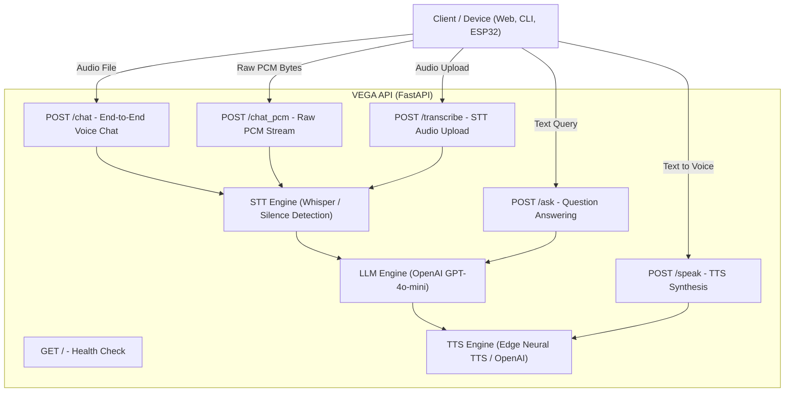

# 🎙️ VEGA - Multimodal AI Voice Assistant API

[](https://github.com/vega-assistant/vega-voice-assistant/actions/workflows/ci.yml)
[](https://fastapi.tiangolo.com)
[](https://www.python.org/)
[](https://opensource.org/licenses/MIT)

**VEGA** is a high-performance, multimodal AI Voice Assistant REST API engineered with **FastAPI**. It provides end-to-end voice intelligence, combining Speech-to-Text (STT), Large Language Model (LLM) reasoning, Text-to-Speech (TTS), and real-time raw PCM byte streaming tailored for IoT hardware (such as ESP32, Raspberry Pi, Arduino) and web/mobile clients.

---

## 🌟 Features

- **⚡ Blazing Fast FastAPI Core**: Asynchronous, high-throughput REST API with interactive Swagger/OpenAPI documentation (`/docs`).
- **🧠 Intelligent LLM Answering**: Powered by OpenAI GPT (`gpt-4o-mini`, `gpt-4o`) with customizable persona and system instructions.
- **🎧 Multimodal Speech-to-Text (STT)**: Transcribe standard audio files (`.wav`, `.mp3`, `.ogg`) using Whisper.
- **🔊 Natural Text-to-Speech (TTS)**: Built-in multi-backend synthesis supporting Microsoft Edge Neural TTS (free, natural, zero API cost) and OpenAI TTS.
- **🔌 Hardware & IoT Native (`/chat_pcm`)**: Direct raw 16kHz 16-bit PCM audio stream processing with built-in silence/RMS detection. Perfect for ESP32 and microcontrollers with I2S microphones.
- **🌐 Ready-to-Use Clients**: Includes a terminal CLI client, interactive browser web interface, and ESP32 Arduino firmware.
- **🐳 Docker & CI Ready**: Preconfigured with `Dockerfile`, `docker-compose.yml`, and GitHub Actions CI workflow.

---

## 🏗️ Architecture



---

## 🚀 Quick Start

### 1. Prerequisites
- Python 3.10+
- (Optional) `ffmpeg` and `libsndfile` for audio decoding.

### 2. Installation
Clone the repository and install dependencies:

```bash
git clone https://github.com/your-org/vega-voice-assistant.git
cd vega-voice-assistant

python -m venv .venv
# On Windows:
.venv\Scripts\activate
# On Linux / macOS:
source .venv/bin/activate

pip install -r requirements.txt
```

### 3. Configure Environment
Copy the sample environment file:

```bash
cp .env.example .env
```

Configure your OpenAI API key and desired settings in `.env`:
```ini
OPENAI_API_KEY=sk-your-openai-api-key
LLM_MODEL=gpt-4o-mini
TTS_ENGINE=edge-tts
TTS_VOICE=en-US-AriaNeural
```

### 4. Run the Server
```bash
uvicorn app.main:app --host 0.0.0.0 --port 8000 --reload
```

Visit the interactive Swagger UI documentation at:
👉 **[http://localhost:8000/docs](http://localhost:8000/docs)**

---

## 📖 API Reference

### 1. Root Status
- **Method:** `GET /`
- **Response:**
  ```json
  { "message": "VEGA API is running!" }
  ```

### 2. Ask Question (Text)
- **Method:** `POST /ask?question={question}`
- **Curl Example:**
  ```bash
  curl -X POST "http://localhost:8000/ask?question=What+is+the+speed+of+light"
  ```
- **Response:**
  ```json
  {
    "question": "What is the speed of light",
    "answer": "The speed of light in a vacuum is approximately 299,792,458 meters per second."
  }
  ```

### 3. Text-to-Speech (Speak)
- **Method:** `POST /speak?text={text}`
- **Curl Example:**
  ```bash
  curl -X POST "http://localhost:8000/speak?text=Hello+I+am+VEGA"
  ```
- **Response:**
  ```json
  {
    "message": "VEGA finished speaking",
    "text": "Hello I am VEGA"
  }
  ```

### 4. Transcribe Audio
- **Method:** `POST /transcribe`
- **Payload:** `multipart/form-data` with `file: UploadFile`
- **Curl Example:**
  ```bash
  curl -X POST -F "file=@sample.wav" "http://localhost:8000/transcribe"
  ```
- **Response:**
  ```json
  { "text": "What time is it in Tokyo?" }
  ```

### 5. Full Voice Chat
- **Method:** `POST /chat`
- **Payload:** `multipart/form-data` with `file: UploadFile`
- **Curl Example:**
  ```bash
  curl -X POST -F "file=@question.wav" "http://localhost:8000/chat"
  ```
- **Response:**
  ```json
  {
    "question": "What time is it in Tokyo?",
    "answer": "In Tokyo, Japan, it is currently 9:00 PM."
  }
  ```
  *(Note: If audio is silent or no speech is detected, returns `{"question":"","answer":"","message":"No speech detected"}`)*

### 6. Raw PCM Voice Streaming (Hardware / IoT)
- **Method:** `POST /chat_pcm`
- **Headers:** `Content-Type: application/octet-stream`
- **Payload:** Raw 16-bit 16kHz mono PCM byte stream.
- **Curl Example:**
  ```bash
  curl -X POST --data-binary "@audio.pcm" "http://localhost:8000/chat_pcm"
  ```
- **Response:**
  ```json
  {
    "question": "Turn on the living room lights",
    "answer": "I have turned on the living room lights."
  }
  ```

---

## 🧪 Testing

Run unit and integration tests with pytest:

```bash
pytest tests/ -v
```

---

## 🐳 Docker Deployment

Run with Docker Compose:

```bash
docker-compose up --build -d
```

---

## 💻 Hardware Integration (ESP32)

VEGA includes full firmware code for microcontrollers in [`examples/esp32_firmware.ino`](examples/esp32_firmware.ino).
1. Connect an **INMP441** or **ICS-43434** I2S microphone to your ESP32.
2. Flash the sketch using Arduino IDE or PlatformIO.
3. Audio is automatically sampled at 16kHz and streamed directly to `POST /chat_pcm`.

---

## 📄 License

This project is licensed under the MIT License. See the [LICENSE](LICENSE) file for details.
